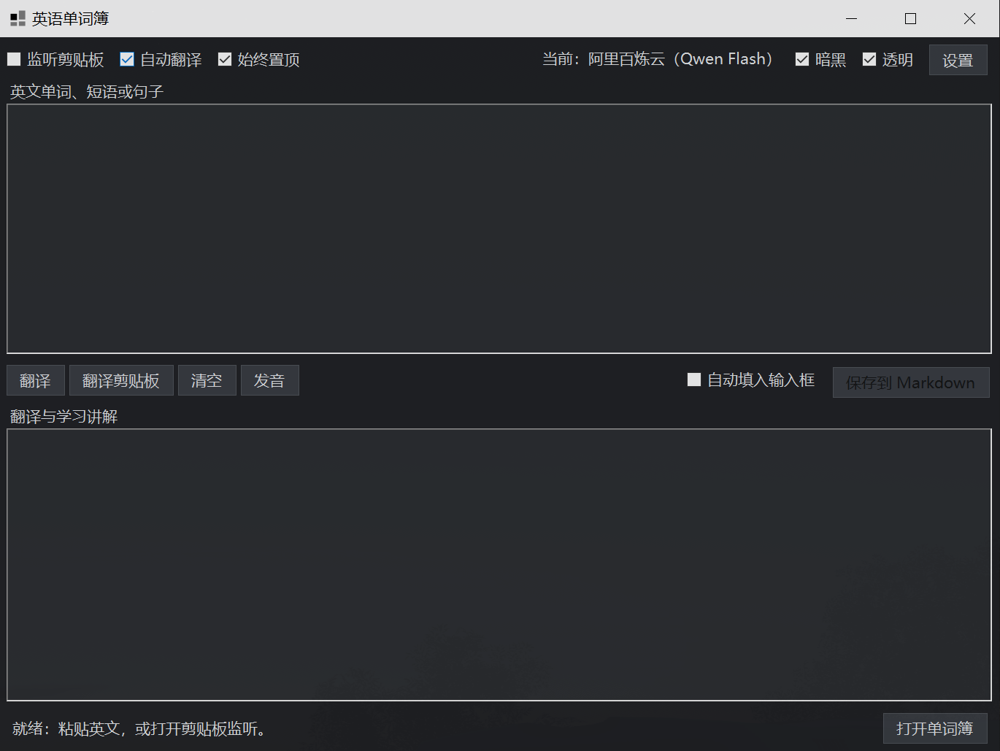

# 英语单词簿 / EnglishWordbook

轻量的 Windows 英语学习程序：翻译单词、短语和句子，用大模型生成中文学习讲解，并保存到本地 Markdown 单词簿。


## 界面预览



## 功能

- 支持 DeepSeek、阿里百炼云（Qwen Flash）和自定义 OpenAI 兼容接口；API Key 仅保存于当前 Windows 用户的本地配置。
- 支持思考模式“自动 / 开启 / 关闭”，并按 API 供应商独立保存和自动恢复 API Key。
- 支持剪贴板监听、自动翻译、仅在本程序输入框内生效的“自动填入输入框”。
- 支持 `Enter` 翻译、`Shift + Enter` 换行、窗口内 `Ctrl + S` 保存 Markdown；全局显示 / 隐藏快捷键可在设置中自定义，默认 `Ctrl + Q`。
- 支持暗黑模式、透明模式、始终置顶、可拖动的上下编辑区和 Windows 本机英语发音。
- 所有供应商的学习记录保存到同一个本地 Markdown 文件；保存时不重复写入“原文”小节。
- 翻译成功后自动全选英文输入框，下一次粘贴可直接替换原文；上方英文输入框统一使用 Arial 10 号，其他界面文字使用微软雅黑 9 号。
- 默认学习提示词会按输入类型路由：词汇类只输出有实质内容的核心意思、用法、同义表达、相关单词（附翻译）、例句和适用的易错点；句子/段落类先给出“【中文翻译】”，再解析核心表达与语法，并主动识别固定搭配、习语、俚语和短语动词，不输出空栏目或模板说明。保存笔记时会删除讲解开头重复的原词，保留条目标题。

## 安装和使用

请从 GitHub Releases 下载 Windows 安装包。安装完成后，在“设置”中填写你自己的 API Key。

> 不要把 API Key、`settings.json` 或个人 Markdown 单词簿上传到 GitHub。

## 从源码构建

环境：Windows 10/11、.NET 8 SDK、PowerShell 7 或 Windows PowerShell。

```powershell
dotnet build .\src\EnglishWordbook\EnglishWordbook.csproj -c Release
.\scripts\Publish-Installer.ps1
```

脚本会生成自包含的 64 位 Windows 安装程序到 `dist\EnglishWordbookInstaller.exe`；目标电脑无需预先安装 .NET。

## 目录

```text
src/EnglishWordbook/            主程序（WinForms）
src/EnglishWordbookInstaller/   安装程序
scripts/Publish-Installer.ps1   可重复构建安装程序的脚本
NOTICE.md                       致谢与第三方服务说明
```

## 隐私与安全

- 程序不会把 API Key、设置或学习笔记打进安装包。
- “自动填入输入框”只会在英语单词簿自己的英文输入框获得鼠标点击时读取剪贴板；不会向其他应用发送 `Ctrl + V`。
- 模型请求会发送给你在设置中选择的服务商。请不要翻译不应发送给第三方的机密内容。

## 致谢

本项目的产品灵感来自 [CopyTranslator](https://github.com/CopyTranslator/CopyTranslator) 的剪贴板翻译工作流。感谢 Elliott Zheng 和 CopyTranslator 社区的开源贡献。

EnglishWordbook 是独立实现，非 CopyTranslator 官方项目、分支或附属产品。详细说明见 [NOTICE.md](NOTICE.md)。

## 许可证

本项目采用 [GNU General Public License v2.0 only](LICENSE)（GPL-2.0-only）发布。
